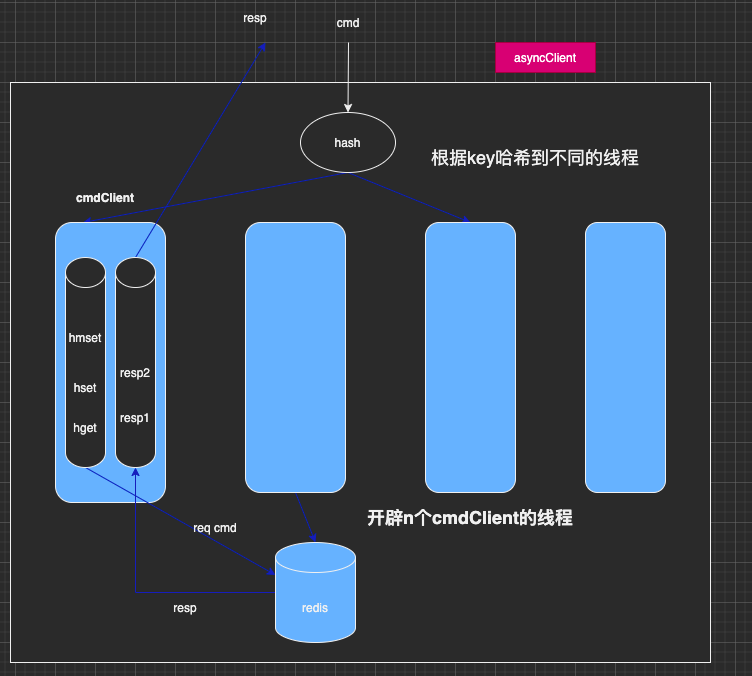

# redisxCli
```` 
  1.一个redis client操作的封装,用于操作redis,可以根据需求更换redis实现
  2.可支持redis的所有命令
  
```` 
# 异步redis client
````
  1.支持异步操作
  2.支持多线程写命令
  3.支持异步回调结果
  目的：redis的执行命令不阻塞业务逻辑主线程，并支持回调结果
  ````
# 异步client架构图  
